# SUS NFC Tag Editor

<p align="center">
    
</p>

<p align="center">
    <a href="#sobre-el-repositorio">Sobre el repositorio</a> ·
    <a href="#funcionalidades">Funcionalidades</a> ·
    <a href="#desarrollo">Desarrollo</a> ·
    <a href="#capturas">Capturas</a>
</p>

## Sobre el repositorio

### Qué es esto

Una herramienta de Android para leer y editar etiquetas NFC, con un diseño
escalable: puedes implementar cualquier familia de etiquetas, lo demás está todo listo.

Además la app se apoya sobre dos ideas:

- **Editar cualquier etiqueta**, venga firmada de fábrica o no.
- **Decir qué pasa de verdad** cuando algo falla, en vez del clásico «no se ha podido leer la etiqueta»

Está implementada sobre la familia NTAG21x, que es la que tenía a mano, pero el
diseño no depende de ella: añadir otro modelo es implementar su clase y queda
listo para funcionar, sin esperar a nadie.

También trae pruebas sencillas para ver si la etiqueta cumple lo que declara:
si el bloqueo por contraseña funciona de verdad y si tiene la memoria que dice
tener.

⚠️ **Solo probado contra un NTAG216 real.** El resto del catálogo está escrito
según el datasheet, y la propia app marca cada modelo como probado o sin probar
para que sepas si es seguro operar sobre él.

### Sobre el nombre y el icono

Todo esto nace de una etiqueta barata y de procedencia dudosa. Las apps de
siempre se negaban a hacer ciertas operaciones sobre ella y lo despachaban con
un «no se puede realizar esta operación, no es una etiqueta válida», cuando sí
se podía, además de varias funcionalidades más que ni siquiera aparecían. De ahí
el nombre, **SUS NFC Tag**: la sospechosa es la etiqueta.

El icono va en la misma línea. *Sus* es sospechoso, así que el sujeto es un
tripulante de Among Us _que puede ser el impostor_ ofreciéndote una etiqueta
NFC de origen incierto. La llave inglesa que lleva es la otra mitad del chiste:
esto es una herramienta para editar la etiqueta.

## Funcionalidades

La app hace con cada etiqueta todo lo que esa etiqueta sabe hacer, ni más ni
menos. Con un NTAG216, por ejemplo: identificarla al acercarla y sacar su ficha
(UID, ATQA/SAK, modelo, capacidad y firma de fábrica), leer el contenido
grabado, ver el contador de lecturas, escribir enlaces, texto, teléfonos,
emails, SMS, ubicaciones o apps de Android en un único mensaje, dejarla vacía
pero válida, poner y quitar la contraseña, elegir desde qué página protege y
extender esa protección también a la lectura.

A eso se le suman tres cosas que no vienen de la etiqueta:

- **Probar si la protección es real:** pone una contraseña, intenta escribir sin
  autenticarse y la quita, para ver si el bloqueo se cumple o es de adorno.
- **Probar si la memoria es la que dice:** escribe, relee y borra página por
  página hasta saber cuánto espacio hay de verdad.
- **Explicar los errores:** cuando una instrucción no sale, la app dice qué se
  envió, qué respondió la etiqueta y dónde se paró, en lugar de un «no se ha
  podido».

## Desarrollo

### Modelos soportados

El catálogo cubre 30 modelos repartidos en las siete familias que he encontrado
investigando; si hay más, se añaden sin problema.

| Familia | Modelos | Probados |
|---|:--:|:--:|
| Type 2 (Ultralight, NTAG21x, NTAG I2C) | 13 | 1 |
| Type 4 (DESFire, NTAG424 DNA, MIFARE Plus, ST25TA) | 6 | 0 |
| Classic (Mini, 1K, 4K) | 3 | 0 |
| Type 5 (ICODE SLIX, ST25TV) | 3 | 0 |
| Type 3 (FeliCa) | 2 | 0 |
| Type 1 (Topaz) | 2 | 0 |
| Type B (SRI512) | 1 | 0 |

Cada modelo es una clase dentro de `lib/chips/`, agrupada por familia. Añadir
otro es escribir su clase y declarar lo que sabe hacer.

### Puesta en marcha

Hacen falta [Flutter](https://flutter.dev) y Dart, un Android conectado por USB
y una etiqueta NFC que probar.

```
flutter pub get
flutter run
```

Compilar:

```
flutter build apk
flutter build appbundle
```

### Cómo está montado

Cada chip es una clase que hereda de su familia. Cada funcionalidad es una
interfaz, y el chip implementa solo las de lo que su modelo sabe hacer:

| Interfaz | Qué hay que implementar |
|---|---|
| `Identifiable` | Leer la ficha de la etiqueta y decir si es de este modelo |
| `Readable` | Leer el contenido grabado |
| `Writable` | Escribir contenido |
| `Erasable` | Borrar el contenido dejando la etiqueta válida |
| `Counted` | Leer el contador de lecturas |
| `PasswordProtected` | Leer el estado de seguridad, poner y quitar contraseña |
| `ReadProtected` | Extender la protección también a la lectura |
| `OriginalitySigned` | Leer la firma de fábrica |

Además, el chip declara sus límites: cuánto contenido admite, qué forma tiene su
contraseña, desde qué página puede proteger y si lleva contador.

Con eso basta. El resto de la app trabaja contra las interfaces, no contra
modelos, y la propia pantalla se adapta a lo que haya delante: la lista de
operaciones se monta a partir de lo que el chip implementa y declara, así que un
chip sin contador no enseña la opción del contador y uno sin contraseña se queda
sin el apartado de protección. Los formularios salen de los mismos límites —el
campo de la contraseña con los bytes que pida el modelo, el editor avisando
cuando el contenido no cabe—. La clase del chip se recrea después de cada uso,
así que no guarda estado entre operaciones.

## Capturas

<table>
  <tr>
    <td width="33%" valign="top">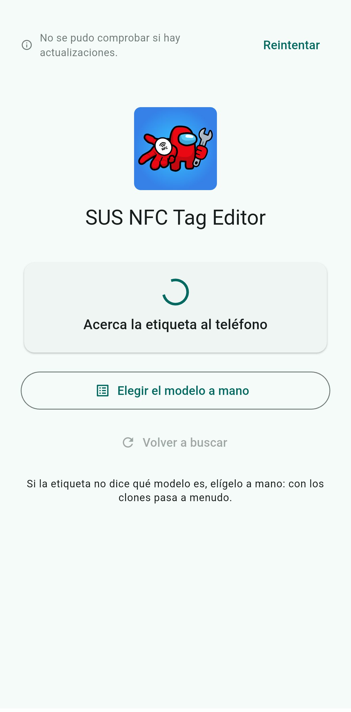<br><sub><b>Portada, buscando etiqueta.</b> La sesión NFC ya está abierta y la app espera a que se acerque la etiqueta al teléfono.</sub></td>
    <td width="33%" valign="top">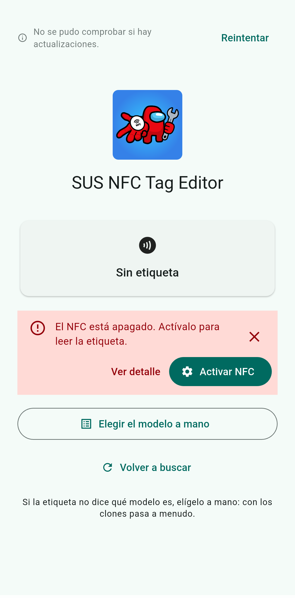<br><sub><b>NFC apagado.</b> Los errores salen en una tarjeta roja que no se va sola, con «Ver detalle» y un atajo a los ajustes del sistema.</sub></td>
    <td width="33%" valign="top">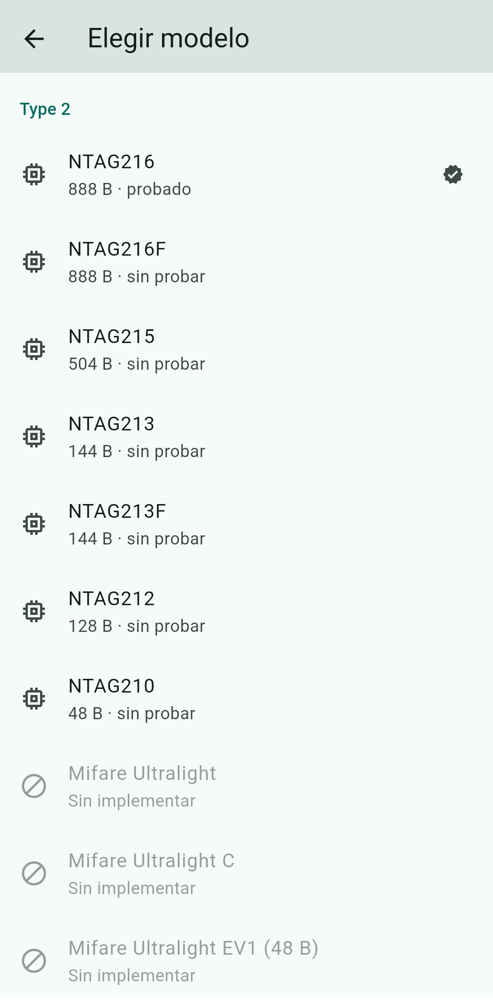<br><sub><b>Elegir el modelo a mano.</b> Los chips de tipo 2 soportados, con su capacidad y si están probados; útil cuando el clon no dice qué es.</sub></td>
  </tr>
  <tr>
    <td width="33%" valign="top">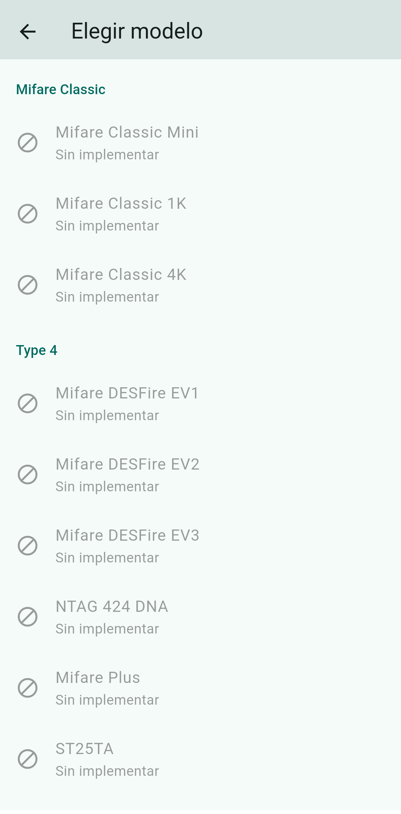<br><sub><b>El resto del catálogo.</b> Mifare Classic, DESFire y compañía aparecen marcados como «sin implementar»: se ven, pero no se pueden elegir.</sub></td>
    <td width="33%" valign="top">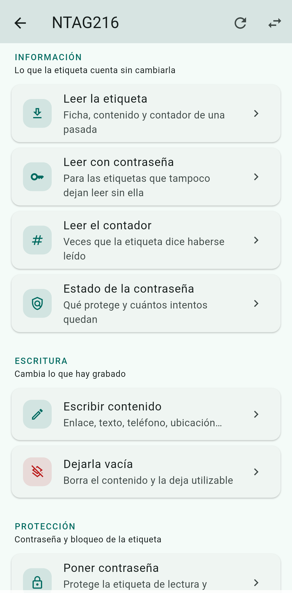<br><sub><b>Qué se puede hacer con la etiqueta.</b> Las operaciones agrupadas en información, escritura y protección.</sub></td>
    <td width="33%" valign="top">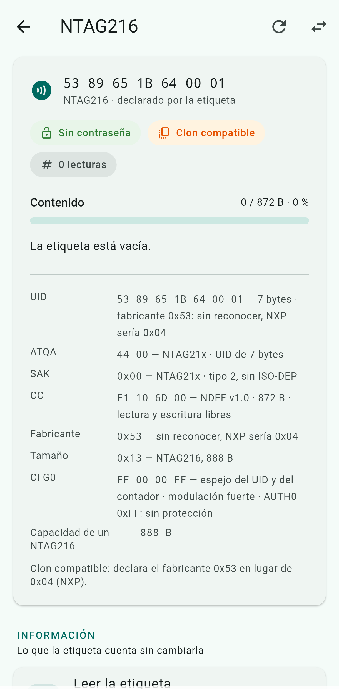<br><sub><b>Ficha de la etiqueta.</b> UID, ATQA/SAK, CC, fabricante, tamaño y CFG0 de una etiqueta vacía, sin contraseña y detectada como clon compatible.</sub></td>
  </tr>
  <tr>
    <td width="33%" valign="top">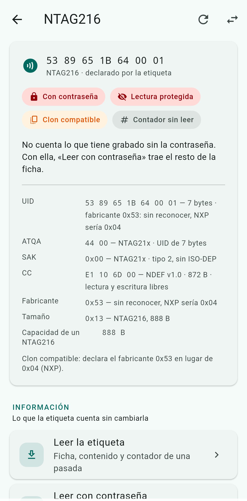<br><sub><b>Etiqueta protegida.</b> Con la contraseña activada y la lectura protegida, la ficha llega incompleta hasta que se lee autenticándose.</sub></td>
    <td width="33%" valign="top">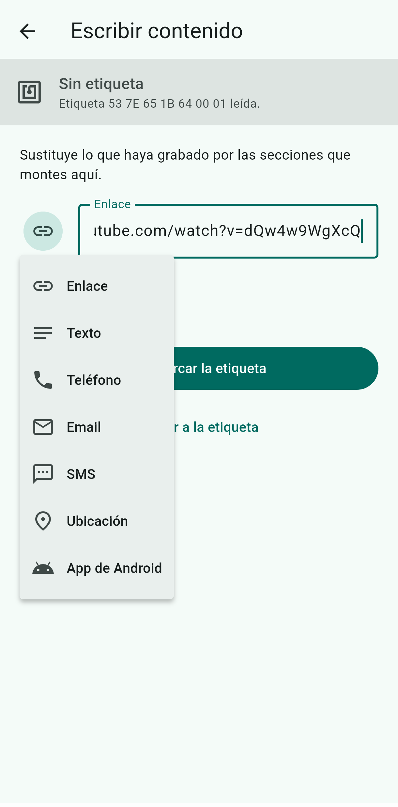<br><sub><b>Escribir contenido.</b> Enlace, texto, teléfono, email, SMS, ubicación o app de Android; las secciones se montan y se graban en un único mensaje NDEF.</sub></td>
    <td width="33%" valign="top">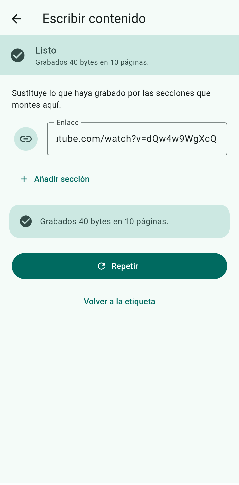<br><sub><b>Escritura terminada.</b> La app dice cuántos bytes ha grabado y en cuántas páginas, sin haber soltado la conexión.</sub></td>
  </tr>
  <tr>
    <td width="33%" valign="top">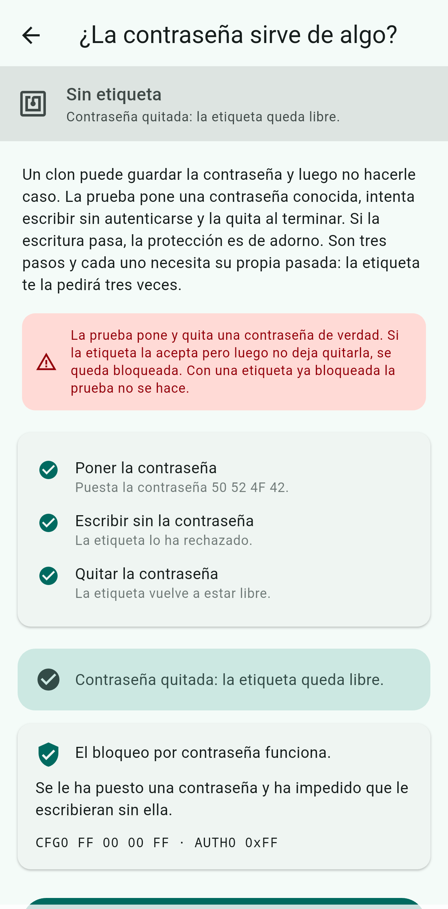<br><sub><b>¿La contraseña sirve de algo?</b> Pone una contraseña conocida, intenta escribir sin autenticarse y la quita: así se ve si la protección es real o de adorno.</sub></td>
    <td width="33%" valign="top">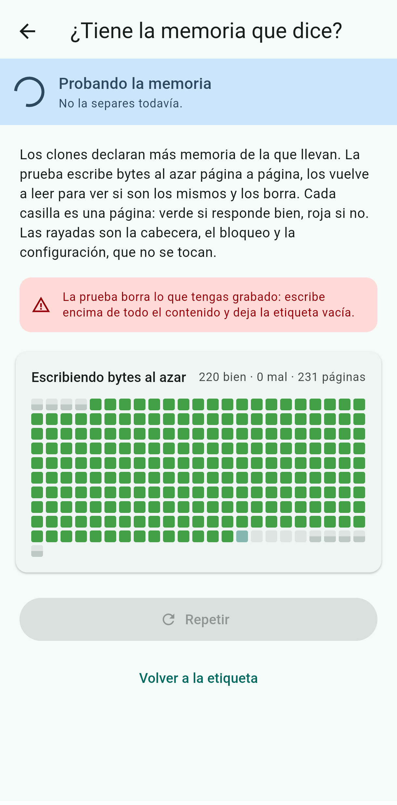<br><sub><b>Prueba de memoria en curso.</b> Una casilla por página: escribe bytes al azar, los relee y los borra, y pinta de verde las que responden bien.</sub></td>
    <td width="33%" valign="top">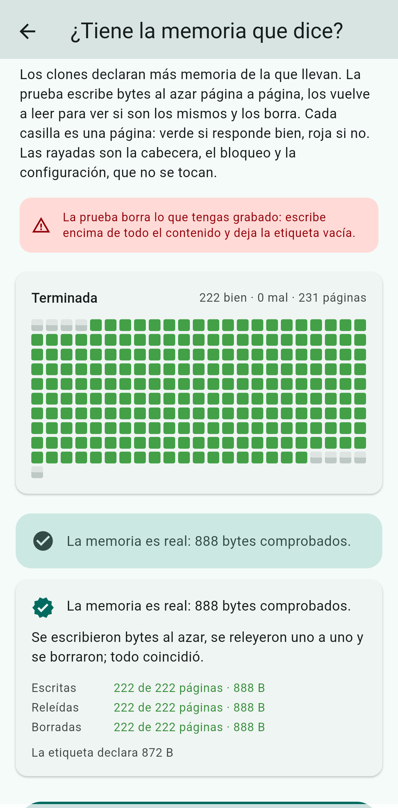<br><sub><b>Memoria comprobada.</b> El resumen final compara lo escrito, releído y borrado con lo que la etiqueta declara tener.</sub></td>
  </tr>
</table>
